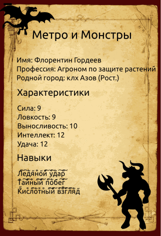

# python_task_cards
DWMN excersize #5

Урок 5. Создаём человеков

Любитель настольных игр Денис вдохновился популярной игрой Dungeons & Dragons и сделал свою — Метро & Монстры. Суть та же, антураж интереснее: игроки создают себе персонажей, а ведущий задаёт истории, в которые эти персонажи попадут. Им предстоит отбиваться от минотавров под Китай-городом, испить из фонтана на Римской и покорить лестницу в небеса на Серпуховской.

Есть только одна проблема: чтобы история была увлекательной, Денису приходится придумывать сотни неигровых персонажей. И фантазия его медленно, но верно истощается.

Срочно нужна помощь! Идея, в принципе, простая: генерируем случайные имя, характеристики и навыки и заносим их в карточку. Есть только одно «но»: Денис – профессиональный настольщик, а не программист.

В этом уроке вы:

освоите библиотеку для тестирования Faker
узнаете о списках и словарях
напишете несколько циклов
